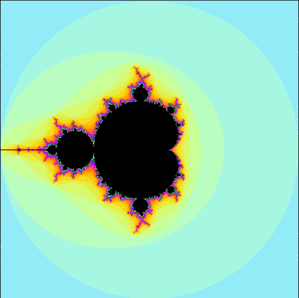
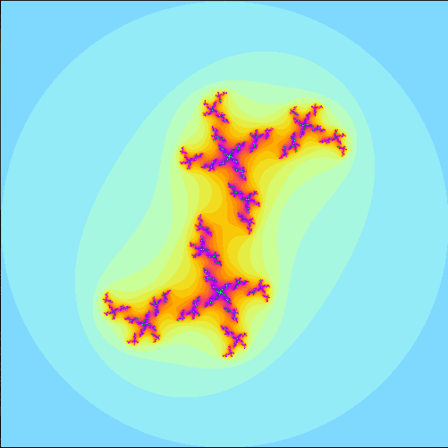

_This project has been created as part of the 42 curriculum by rfoo._

# fractol

## Description

A fractal is an abstract mathematical object, such as a curve or surface, whose pattern remains consistent at every scale.

We will be using 42’s graphical library, the MiniLibX. This library was developed internally and includes basic necessary tools to open a window, create images and deal with keyboard and mouse events.

### Mandelbrot Set

The Mandelbrot set is the collection of complex numbers **c** for which the iterative function *zₙ₊₁ = zₙ² + c* (starting at z₀ = 0) remains bounded and does not escape to infinity. When plotted, it produces the famous cardioid‑shaped fractal with infinitely detailed boundaries. Each point in the Mandelbrot set corresponds to a Julia set, and the set itself acts as a “map” of all possible Julia fractals.



_Figure 1.0 Mandelbrot Set_

### Julia Set

A Julia set is generated by fixing a constant c and iterating the function
zₙ₊₁ = zₙ² + c for different starting values of z.

- If c lies inside the Mandelbrot set, the Julia set is connected (a single continuous fractal).

- If c lies outside, the Julia set is disconnected, forming scattered “dust” patterns.

Julia sets are highly diverse: different values of c produce wildly different shapes, ranging from dendrite‑like filaments to Cantor dust. 



_Figure 2.0 Julia Set with starting value of 0.33 + 0.66i_

Together with the Mandelbrot set, they form the foundation of complex dynamics and fractal geometry.

## Instructions

To compile the program, run:

```
make
```
This compiles the program as an executable `fractol`.

To use:

```
./fractol mandelbrot

OR

./fractol julia <Re> <Im>
```

### Examples

The Mandelbrot set is fixed, but you can adjust the real and imaginary values of the constant to view different Julia sets. 

```
# c = 0.33 + 0.66i
./fractol julia 0.33 0.66

# c = 0.66 + 0.33i
./fractol julia 0.66 0.33
```

## Resources

- [Libft](https://github.com/RussellFSJ/libft)
- [What's so special about the Mandelbrot Set? - Numberphile](https://www.youtube.com/watch?v=FFftmWSzgmk)
- [Fractals are typically not self-similar](https://www.youtube.com/watch?v=gB9n2gHsHN4)